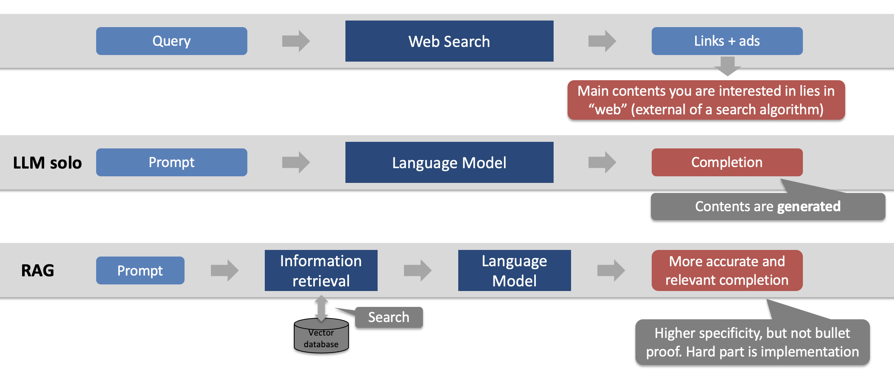

# Actuarial Standards of Practice (ASOP) Q&A machine using Retrieval Augmented Generation (RAG)
## 1. Description
This project aims to create a Retrieval-Augmented Generation (RAG) process for actuaries to ask questions on a set of Actuarial Standards of Practice (ASOP) documents. The RAG process utilizes the power of the Large Language Model (LLM) to provide answers to questions on ASOPs.

However, RAG is not without challenges, i.e., hallucination and inaccuracy. The project example allows verifiability by providing the context an LLM used to arrive at those answers. This process enables actuaries to validate the LLM's answers, empowering them to make informed decisions. By combining the capabilities of LLM with verifiability, this RAG process offers actuaries a robust tool to leverage LLM technology effectively and extract maximum value.

The current example uses OpenAI's GPT 3.5 turbo and open-source LLMs (e.g., Mistral 7B Instruct, SOLAR 10.7B Instruct). The open-source models can be used locally and can address potential data privacy or security concerns.

Please see a [Jupyter notebook (ASOP_RAG.ipynb)](./notebook/ASOP_RAG.ipynb) for details of the Python codes in the `notebook` folder. You can choose either Open AI or open-source LLM to use the RAG.  
An alternative [notebook (ASOP_RAG_compare.ipynb)](./notebook/ASOP_RAG_compare.ipynb) outputs the responses from both Open AI and an open-source LLM for comparison purposes.

Here are the open-source models used:
- Mistral 7B Instruct: [Apache License 2.0](https://ollama.com/library/mistral/blobs/sha256:43070e2d4e532684de521b885f385d0841030efa2b1a20bafb76133a5e1379c1)
- SOLAR 10.7B Instruct: [cc-by-nc-4.0](https://huggingface.co/upstage/SOLAR-10.7B-Instruct-v1.0) (non-commercial use)
- [GPT4All embedding model](https://python.langchain.com/docs/integrations/text_embedding/gpt4all)
- [Chroma DB](https://www.trychroma.com/) for vector database

The RAG process used LangChain and Ollama frameworks.  
- LangChain is a framework for developing applications powered by LLMs.
- Ollama is an effective way to get up and running with LLMs locally. 

See below for acknowledgments and references.

## 2. Output
### 2.1 Demo App
  
Explore the potentials of RAG by visiting the Streamlit web app (https://asop-search.streamlit.app/) powered by GPT 3.5 turbo.

### 2.2 Example Output

#### Question
User prompt: explain ASOP No. 14  
- *Note: Asking this question to LLMs (such as ChatGPT 4) often leads to hallucination as they often explain the ASOP as if it is not repealed or refer to other ASOP documents.*
- *Note: The RAG provides both the answer and context.*

#### Answer
ASOP No. 14 was reviewed as part of a project to look at all cash flow testing standards of practice, and relevant portions were incorporated into the revisions of ASOP No. 7 and ASOP No. 22. The ASB voted to adopt the revised ASOP No. 7 and ASOP No. 22 and to repeal ASOP No. 14 in September 2001. The effective date of ASOP No. 7 was deferred to July 15, 2002, while concerns were reviewed regarding its applicability to property/casualty practice.

#### Context
*Note: Providing context to the answer allows actuaries to review and validate.*
- Source 1: ../data/ASOP/asop007_128.pdf, page 5:  
virelated to cash flow testing. Finally, the ASB has adopted a new format for standards, and this standard has been rewritten to conform to that new format. In addition to ASOP No. 7, as part of the project to look at all cash flow testing standards of practice, ASOP No. 14 and ASOP No. 22 were al so reviewed. Relevant portions of ASOP No.  
14 were incorporated within the 2001 revisions of ASOP No. 7 and ASOP No. 22. At its September 2001 meeting, the ASB voted to adopt the revised ASOP No. 7 and ASOP No. 22 and to repeal ASOP No. 14. In April 2002, the ASB voted to defer the effective date of ASOP No. 7 to July 15, 2002 while it reviewed concerns raised by the Academy’s Casualty Practice Council regarding the standard’s applicability to property/casualty practice. At its June 2002 meeting, the ASB amended the scope to conform to generally accepted casualty actuarial practice. Please see appendix 3 for further information. Exposure Draft

- Source 2: ../data/ASOP/asop004_173.pdf, page 31:  
are found in the current version of ASOP No. 4. The reviewers believe the reference to Precept 8 remains appropriate. The reviewers do not believe that the proposed change significantly improves the language included in the current version of ASOP No. 4, and made no change.  

- Source 3: ... *(all the context not shown in this illustration)*

## 3. Model
### 3.1 Conceptual Flow
RAG combines search and LLM generations.  

LLM completions are the results of model inference based on locked-in parameters. Any knowledge or information from LLM can be outdated unless augmented by external sources. RAG connects external documents, searches the document, and provides the relevant context to LLM. The external documents are transformed into a vector database during the initial setup stage for an effective search.  

For applications in practice, one should note that RAG is not perfect and can still lead to errors in searching or generating irrelevant or incorrect responses. As such, verifiability in RAG becomes crucial for actuarial use cases.

### 3.2 RAG Implementation Steps
    1. Decide whether to use OpenAI or local open-source models
    2. Select PDF documents (e.g., ASOP) to perform RAG
    3. Transform PDF into texts and divide them into chunks
    4. Convert the chunks into a vector database (Chroma DB) using embedding models (OpenAI, GPT4All)
    5. Retrieve and use LLM (GPT 3.5 Instruct, Solar 10.7B) to generate
    6. Output responses and context for a user to verify

## 4. Author
Dan Kim 

- [@LinkedIn](https://www.linkedin.com/in/dan-kim-4aaa4b36/)
- dan.kim.actuary@gmail.com (feel free to reach out with questions or comments)

## 5. Date
- Initially published on 2/12/2024
- The contents may be updated from time to time
  
## 6. License
This project is licensed under the Apache License 2.0- see the LICENSE.md file for details.

## 7. Acknowledgments and References
- https://www.actuarialstandardsboard.org/standards-of-practice/ (downloaded as of December 2023)
- https://python.langchain.com/docs/use_cases/question_answering/quickstart
- https://python.langchain.com/docs/use_cases/question_answering/sources
- https://chat.langchain.com/
- https://ollama.ai/
- https://www.trychroma.com/
